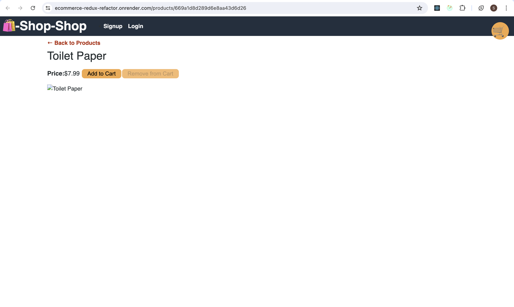

# E-commerce Redux Refactor

This is a full-stack e-commerce application built using React, Redux, Node.js, and Express. The project has been refactored to improve its structure and maintainability.

## Table of Contents

- [Features](#features)
- [Installation](#installation)
- [Usage](#usage)
- [Configuration](#configuration)
- [Deployment](#deployment)
- [Screenshots](#screenshots)
- [Live Demo](#live-demo)
- [Contributing](#contributing)
- [License](#license)

## Features

- **Frontend**: Built with React and Redux for state management.
- **Backend**: Node.js and Express server.
- **Database**: MongoDB for storing product and user data.
- **Deployment**: Deployed on Render.com with continuous integration and deployment.
- **Image Handling**: Integrated image uploading and serving functionality.

## Installation

### Prerequisites

- Node.js (v20.15.1 or later)
- Bun (v1.1.0 or later) - Optional, for enhanced performance
- MongoDB

### Clone the Repository

```bash
git clone https://github.com/StgoWF/ecommerce-redux-refactor.git
cd ecommerce-redux-refactor
```
### Install Dependencies

For the server:

```bash
cd server
npm install
```

For the client:
```bash
cd client
npm install
```

## Usage

### Run Locally

**Backend Server:**

```bash
cd server
npm start
```

**Frontend Client:**
```bash
cd client
npm start
```
Open http://localhost:3000 in your browser to view the application.

### Running Migrations and Seeds

To populate the database with initial data, run:

```bash
cd server
npm run seeds
```
Ensure your MongoDB server is running before executing the seeds.

## Configuration

### Environment Variables

Create a `.env` file in the `server` directory with the following content:

```env
MONGO_URI=your_mongodb_uri
PORT=5000
```
For client-specific environment variables, create a .env file in the client directory with the following content:
```env
REACT_APP_API_URL=http://localhost:5000
```
## Deployment

The application is deployed on Render.com. For deployment, ensure you have the following environment variables set in Render:

- `MONGO_URI`: The URI for connecting to your MongoDB instance.
- `PORT`: The port on which the server will run (default is 5000).

If deploying on Render or a similar service, make sure to:

1. Configure the build and start commands for both the server and client.
2. Set environment variables in the deployment settings.
3. Ensure MongoDB is accessible from your deployed environment.

## Screenshots


*Homepage view*


## Live Demo

You can view the live application at [https://ecommerce-redux-refactor.onrender.com/](https://ecommerce-redux-refactor.onrender.com/).


## Contributing

We welcome contributions to improve the project! To contribute:

1. Fork the repository on GitHub.
2. Clone your forked repository to your local machine.
3. Create a new branch (`git checkout -b feature/your-feature`).
4. Make your changes and commit them (`git commit -am 'Add new feature'`).
5. Push your changes to the branch (`git push origin feature/your-feature`).
6. Open a Pull Request on GitHub.

Please ensure your code adheres to existing style guidelines and includes relevant tests. 

## License

This project is licensed under the MIT License - see the [LICENSE](LICENSE) file for details.
